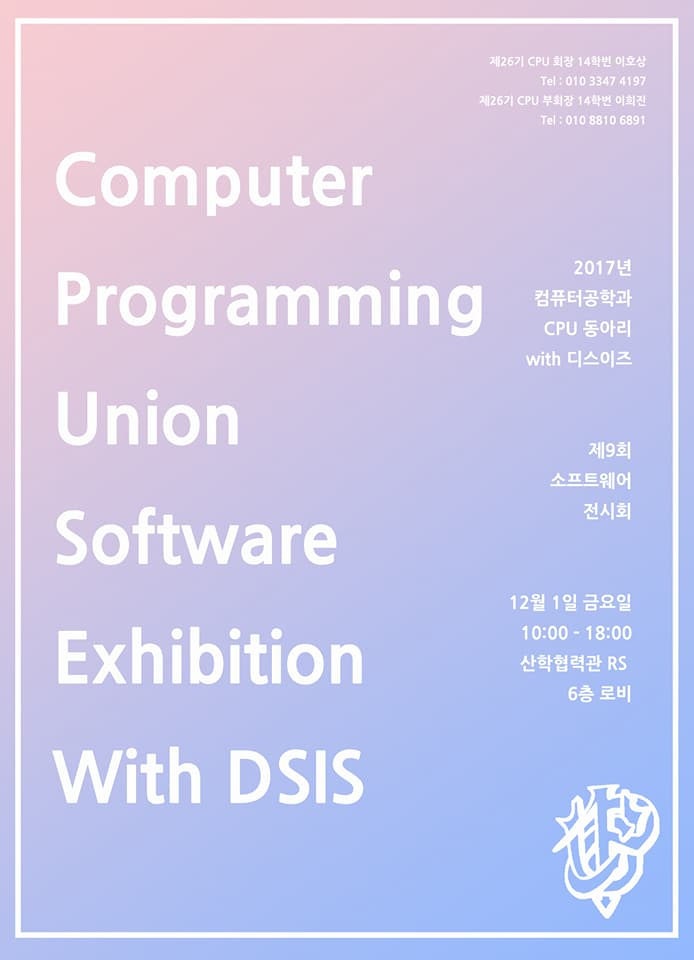
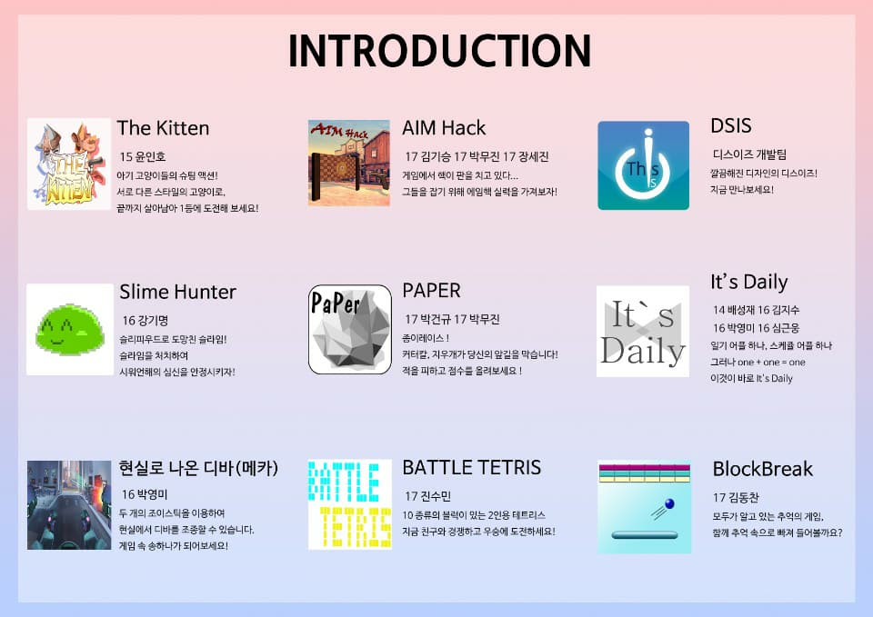
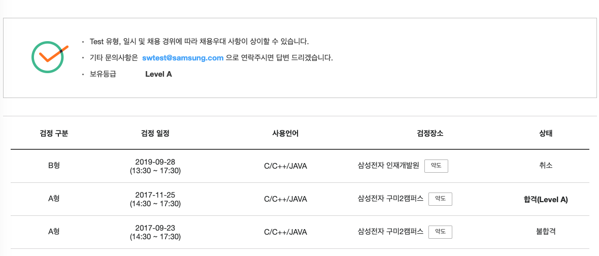
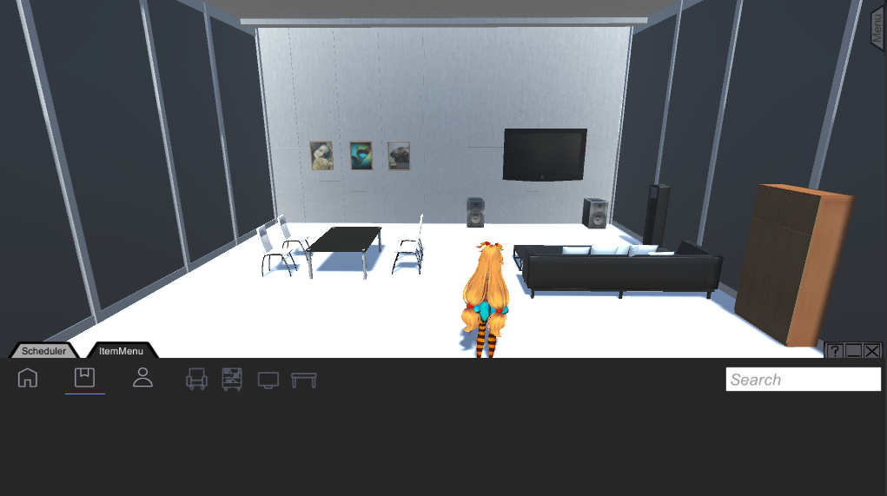
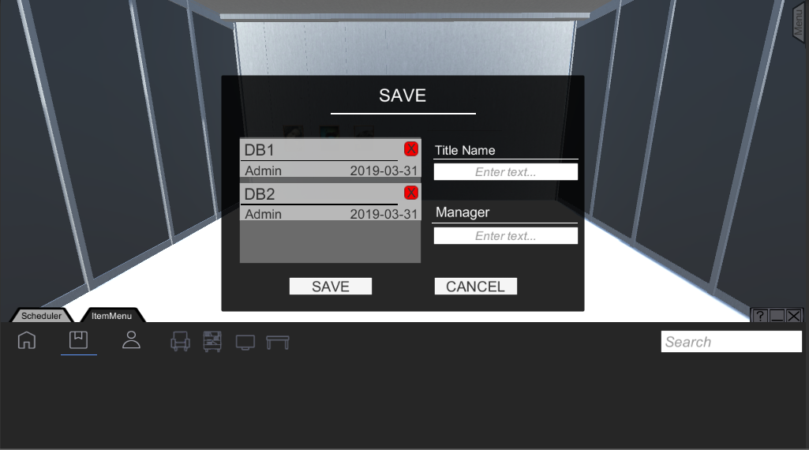
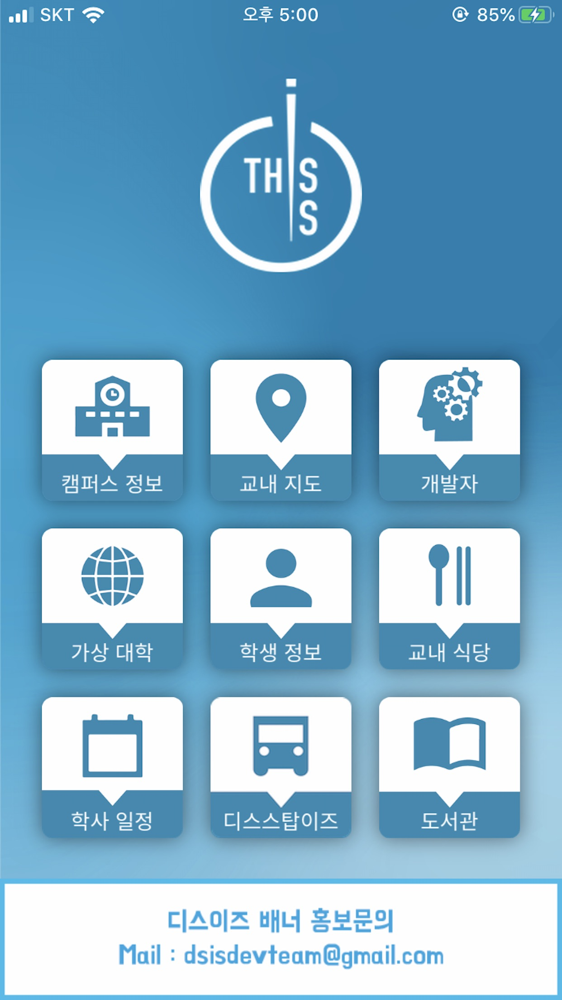
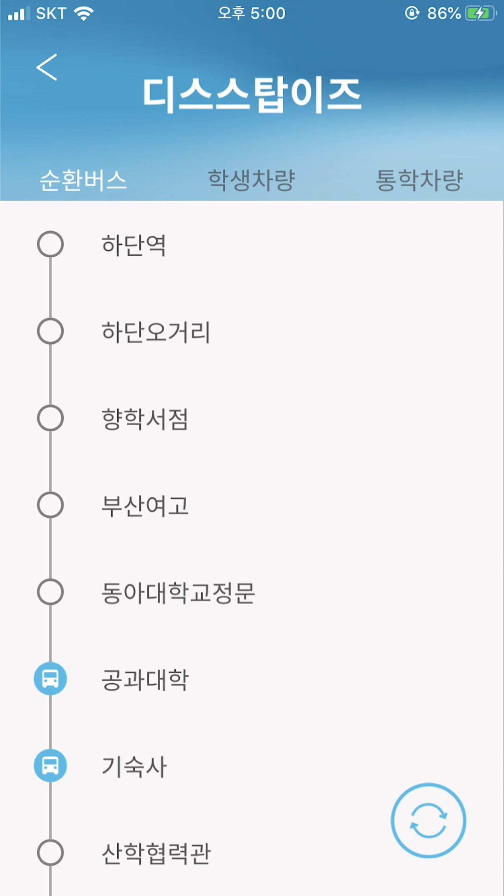
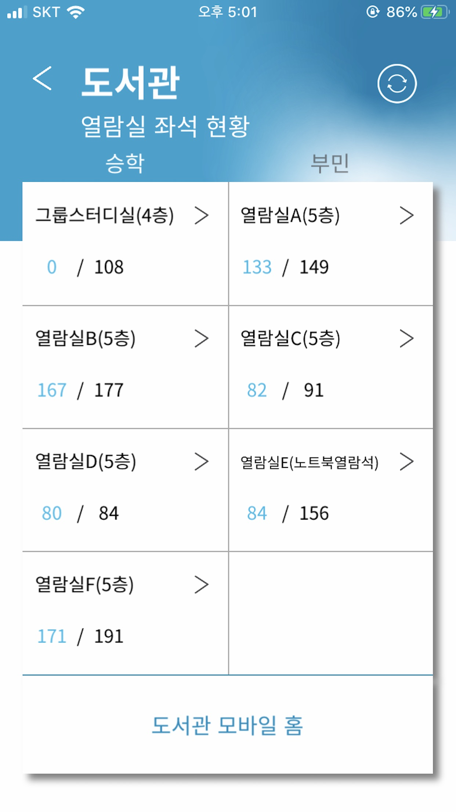

# 심근웅

문제를 접하고 해결하는것에 몰두하기를 좋아하며 좀 더 나은 방향의 해결법을 찾고자 노력하는 개발자입니다

Github : https://github.com/GeunwoongSim

Email : https://geunwoong.sim@gmail.com

BAEKJOON : https://www.acmicpc.net/user/underside

# 활동

### 2019 한국 소프트웨어공학 학술대회(KCSE 2019) 발표
- 기간 : 2019.01.28 ~ 2019.01.30(수)
- 직급 : 학생연구원
- 내용 : 대인관계 개선 VR 콘테츠 생성을위한 저작도구 설계와 구현 [단편논문]

### 디스이즈
- 기간 : 2016.10 ~  2020.09
- 직급 : iOS팀 팀원(2016,2019,2020), iOS팀 팀장(2017), 디스이즈 팀장(2018)
- 홈페이지 : https://dsisteam.com
- facebook : https://www.facebook.com/dsisdevelopers

### 학술동아리 CPU
- 기간 : 2017.02.01 ~ 2018.01.31
- 직급 : PM부장
- 내용 : 제 9회 컴퓨터공학과 소프트웨어 전시회(2017.12.01) 진행

 

### 도전학기제
- 기간 : 2019.03.01 ~ 2019.06.13
- 내용 : 2019년도 1학기동안 가상수업 프로그램 개발

### 삼성 SW 역량테스트 Level A

- 취득 : 2017.11.25
- 사용언어 : C++

  

# 프로젝트

### VR을 이용한 대인 관계 개선 시스템 개발

- 소속 : 동아대학교 정보통신실험실
- 기간 : 2018.06.01 ~ 2019.05.31
- 직급 : 학생연구원
- 사용기술 : Unity ( C# ), TortoiseSVN

### 디스이즈

- 소개 : 스마트캠퍼스 애플리케이션

- 소속 : This is

- 기간 : 2020.02.04 ~ 2021.01.22

- 사용기술 : iOS, Swift, Alamofire, Kanna, Reachability

  

